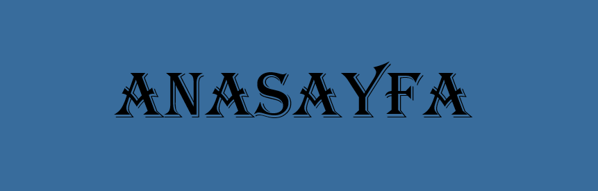
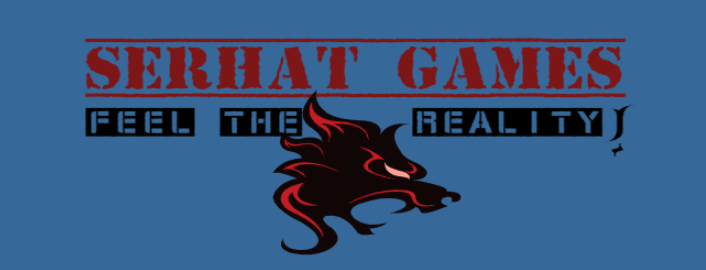
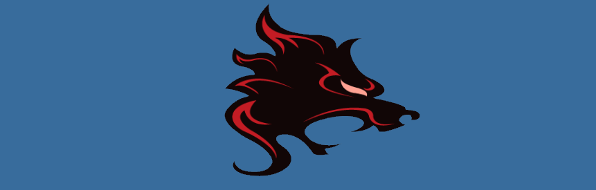
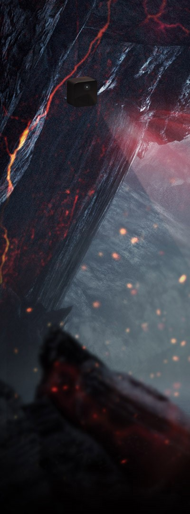
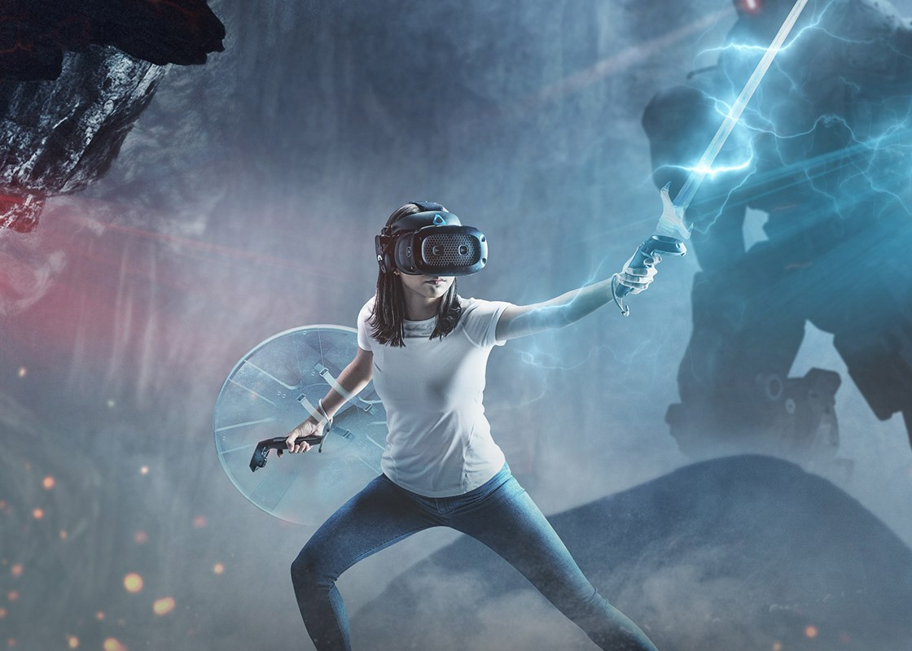
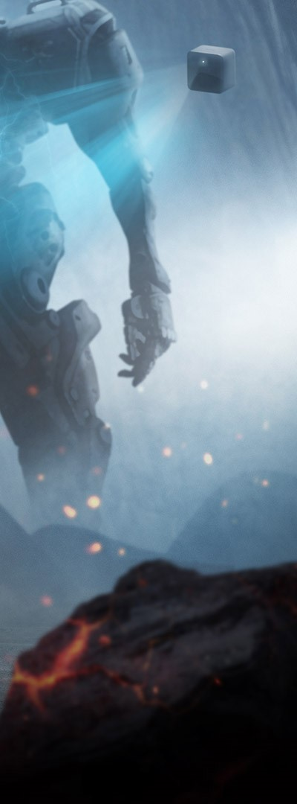

<!DOCTYPE html>
<html lang="tr">
<head>
<title>Serhat Games</title>
<meta charset="utf-8">
<meta name="viewport" content="width=device-width, initial-scale=1">

</head>
<body>

  
  
  

  <a href="index.html">Anasayfa</a>
  <a href="Hizmetlerimiz.html">Hizmetlerimiz</a>
  <a href="Kurumsal.html">Kurumsal</a>
  <a href="Kariyer.html">Kariyer</a>
  <a href="İletişim.html">İletişim</a>

    
  
  

  
  

  	
    <h2 style="text-align: center;">Tanıtım</h2>
    
Şirketimiz, 2016 yılında Ankara'nın merkezinde kurulmuş olup; 4 yıldan beri siz oyunculara hizmet vermektedir. Şirketin kurucusu Serhat Karatorak, oyun dünyasında uzun yıllar boyunca edindiği deneyim ve bilgi birikimi ile uzmanlaşmış bir ekiple birleşip oyuncular için gerçekçi hissettiren oyunlar yapmaya başlamıştır.

    
Türkiyede popülerleştikten sonra Türkiye dışında Londra, Montreal, NYC, Washington, Moskova ve Venedik'te şubelerimiz açılmıştır ve böylelikle şirketimiz dünyaca tanınan oyun yapımcısı haline gelmiştir.

  

  
  

    
    
    
  

  
Sitede yer alan tüm içeriğin hakları saklıdır. 2020 © SERHAT

</body>
</html>
